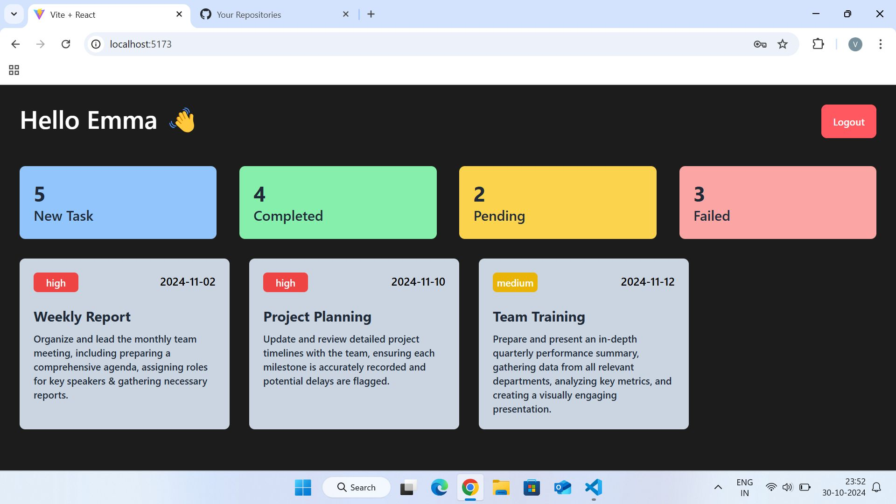
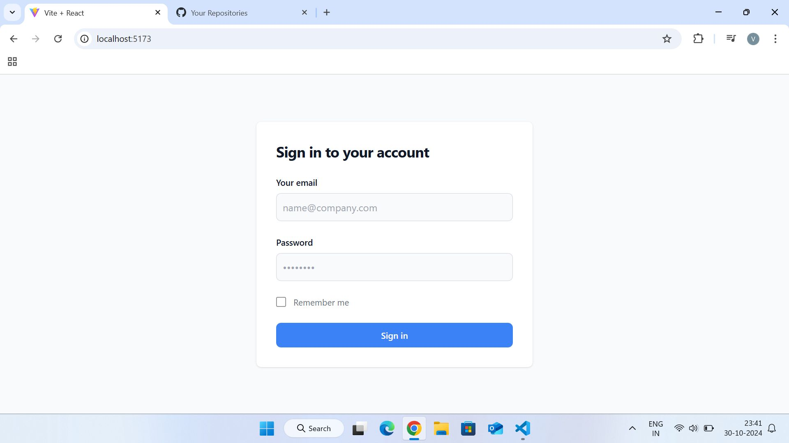

# Employee Management System  

A **React-based web application** with separate **Admin and User panels** for managing employee data, roles, and tasks efficiently. The **Admin panel** allows for employee management, while the **User panel** provides individual access to personal details and tasks.

---

## 🌟 Installation  

1. **Clone the repository**  
   ```bash  
   git clone https://github.com/your-username/employee-management-system.git  
   cd employee-management-system  
   ```

2. **Install dependencies**  
   ```bash  
   npm install  
   ```

3. **Run the development server**  
   ```bash  
   npm start  
   ```

4. Open [http://localhost:3000](http://localhost:3000) in your browser.

---

## 💡 Screenshots  


  


  

---

## 📧 Contact  

**Email**: [varad.manegopale28@gmail.com](mailto:varad.manegopale28@gmail.com)  
